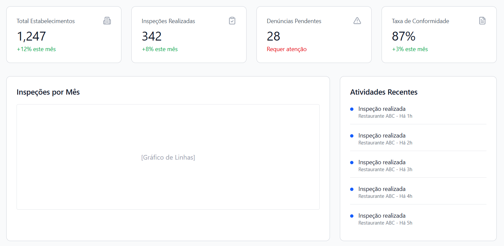

# Projeto-Visa

Sistema de Vigilância Sanitária
Este projeto foi desenvolvido com o objetivo de apresentar uma solução moderna, organizada e intuitiva para o acompanhamento das atividades da Vigilância Sanitária. A proposta do sistema é centralizar informações importantes em um painel administrativo, facilitando o monitoramento de estabelecimentos, inspeções realizadas, denúncias pendentes e índices de conformidade.

A interface foi planejada para oferecer praticidade e clareza visual, permitindo que gestores e usuários responsáveis tenham acesso rápido aos principais dados e indicadores. Além disso, o sistema busca contribuir para uma gestão mais eficiente, auxiliando na tomada de decisões e no acompanhamento das demandas em tempo real.

Entre as funcionalidades apresentadas no protótipo, destacam-se:

Visualização do total de estabelecimentos cadastrados

Controle de inspeções realizadas

Monitoramento de denúncias pendentes

Taxa de conformidade dos estabelecimentos

Histórico de atividades recentes

Gráfico mensal de inspeções

Este projeto representa não apenas uma proposta acadêmica, mas também uma ideia voltada à inovação tecnológica aplicada ao setor público, mostrando como a tecnologia pode ser utilizada para melhorar processos e serviços essenciais à sociedade.

Tecnologias Utilizadas
Figma / Make (Protótipo e Wireframe)

Planejamento de Interface (UI/UX)

Conceitos de Sistemas Web

Autor
Nicollas Azalim Prado

Observação
Este projeto encontra-se em fase conceitual/prototipagem, podendo receber melhorias e novas funcionalidades futuramente.

Aqui estão algumas imagens sobre este projeto!

